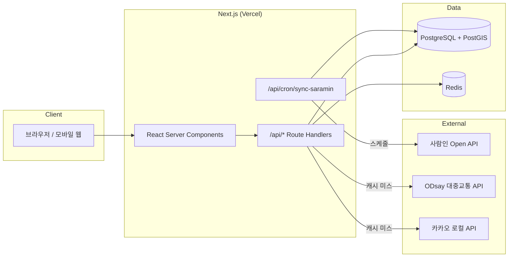

# 개발 가이드 — 진짜시급 (RealWage)

> ### ⚠️ 10시간 해커톤에 참여 중이라면
> **이 문서는 "시간 제약 없이 제대로 만들 때"의 완성형 설계서입니다.**
> 10시간 안에는 이 내용의 90%를 만들 수 없고, 만들려고 시도하면 실패합니다.
>
> 해커톤 당일에는 **[TEAM.md](TEAM.md)** 를 먼저 읽으세요. 축소된 범위, 역할 분담, 시간표가 들어 있습니다.
> 이 문서에서는 다음 두 곳만 보면 됩니다.
> - **[§11 Git 사용 규칙](#11-git-사용-규칙-팀-공통)** ← 해커톤 당일 열어두고 작업
> - [§4 외부 API 연동](#4-외부-api-연동) ← 사람인 / 카카오 / ODsay 호출법
>
> DB(PostgreSQL·Prisma·Redis) 관련 내용은 해커톤에서 **전부 건너뜁니다.**

---

## 1. 아키텍처



### 요청 흐름 — 검색 1회

```
1. POST /api/jobs  { origin, keyword, dailyHours, filters }
2. 후보 조회        PostGIS ST_DWithin 반경 검색 → 최대 100건
3. 경로 조회        후보 좌표별로 Redis → DB 캐시 → (미스만) ODsay 병렬 호출
                    동시성 제한 8, 캐시 미스 상한 20건 (쿼터 보호)
4. 실질시급 계산     lib/calc/realWage.ts — 순수 함수, I/O 없음
5. 정렬 · 페이징     실질시급 내림차순
6. 응답            공고 + 계산결과 + 경로요약
```

**설계 포인트** — 경로 조회가 전체 응답시간을 지배합니다. 캐시 미스가 많은 첫 검색은 스트리밍 응답으로 공고 카드를 먼저 내보내고, 실질시급은 `계산 중…` 상태로 두었다가 채워 넣습니다.

---

## 2. 개발 환경

### 요구 사항
- Node.js 20 LTS
- pnpm 9
- Docker (PostgreSQL + Redis)

### docker-compose.yml

```yaml
services:
  db:
    image: postgis/postgis:15-3.4
    environment:
      POSTGRES_USER: realwage
      POSTGRES_PASSWORD: realwage
      POSTGRES_DB: realwage
    ports: ["5432:5432"]
    volumes: ["pgdata:/var/lib/postgresql/data"]
  redis:
    image: redis:7-alpine
    ports: ["6379:6379"]
volumes:
  pgdata:
```

### 초기 세팅

```bash
pnpm install
cp .env.example .env.local
docker compose up -d
pnpm prisma migrate dev --name init
pnpm db:seed
pnpm dev
```

### 스크립트

| 명령 | 설명 |
|---|---|
| `pnpm dev` | 개발 서버 |
| `pnpm test` | Vitest 유닛 테스트 |
| `pnpm test:e2e` | Playwright |
| `pnpm db:seed` | 최저임금 + 샘플 공고 |
| `pnpm sync:saramin` | 배치 수동 실행 |
| `pnpm lint` / `pnpm typecheck` | ESLint / tsc |

---

## 3. 환경 변수

| 키 | 필수 | 설명 |
|---|---|---|
| `DATABASE_URL` | ✅ | PostgreSQL 연결 문자열 |
| `REDIS_URL` | ✅ | Redis 연결 문자열 |
| `SARAMIN_ACCESS_KEY` | ✅ | 사람인 오픈 API 키 |
| `ODSAY_API_KEY` | ✅ | ODsay LAB 키 (URL 인코딩된 키 그대로) |
| `KAKAO_REST_API_KEY` | ✅ | 서버측 지오코딩 |
| `NEXT_PUBLIC_KAKAO_JS_KEY` | ✅ | 클라이언트 지도 렌더링 |
| `AUTH_SECRET` | ✅ | Auth.js 세션 암호화 |
| `AUTH_KAKAO_ID` / `AUTH_KAKAO_SECRET` | | 카카오 로그인 |
| `CRON_SECRET` | ✅ | `/api/cron/*` 호출 인증 |
| `ROUTE_API_DAILY_BUDGET` | | ODsay 일일 호출 상한 (기본 900) |

> 키는 절대 커밋하지 않습니다. `.env.local`은 `.gitignore`에 포함되어 있고, 배포 환경변수는 Vercel 프로젝트 설정에서 관리합니다.

---

## 4. 외부 API 연동

### 4.1 사람인 오픈 API

```
GET https://oapi.saramin.co.kr/job-search
  ?access-key={KEY}
  &keywords=카페
  &loc_mcd=101000        # 지역 코드
  &job_type=4            # 고용형태(아르바이트)
  &sort=pd               # 등록일순
  &start=0&count=110     # count 최대 110
  &fields=posting-date,expiration-date,count
```

응답 예시(발췌):

```json
{
  "jobs": {
    "count": 110, "start": 0, "total": "3241",
    "job": [{
      "id": "12345678",
      "url": "https://www.saramin.co.kr/...",
      "active": 1,
      "company": { "detail": { "name": "○○물류", "href": "..." } },
      "position": {
        "title": "물류센터 상하차 아르바이트",
        "location": { "code": "102160", "name": "경기 > 고양시 덕양구" },
        "job-type": { "code": "4", "name": "아르바이트" },
        "job-code": { "code": "404", "name": "물류" }
      },
      "salary": { "code": "99", "name": "시급 12,000원" },
      "posting-timestamp": "1757000000",
      "expiration-timestamp": "1758000000"
    }]
  }
}
```

**주의**
- 응답 필드명은 하이픈(`job-type`)을 씁니다. TypeScript에서 접근하려면 브래킷 표기나 매핑 레이어가 필요합니다. `lib/saramin/mapper.ts`에서 카멜케이스 도메인 타입으로 변환하세요.
- **근무시간 정보가 없습니다.** 이 서비스의 최대 제약입니다(§5.2 참고).
- 위치는 `"경기 > 고양시 덕양구"` 수준의 텍스트입니다. 정확한 좌표가 없으므로 회사명+지역으로 지오코딩하고, 실패하면 지역 중심 좌표를 쓰되 `location_is_approximate` 플래그를 세웁니다.
- 일일 호출 한도가 있으므로 실시간 프록시 금지. 반드시 배치 수집 → DB 조회 구조로 갑니다.

```ts
// lib/saramin/client.ts
export async function fetchJobs(params: SaraminQuery): Promise<SaraminJob[]> {
  const url = new URL('https://oapi.saramin.co.kr/job-search');
  url.searchParams.set('access-key', process.env.SARAMIN_ACCESS_KEY!);
  Object.entries(params).forEach(([k, v]) =>
    v != null && url.searchParams.set(k, String(v)));

  const res = await fetch(url, {
    headers: { Accept: 'application/json' },
    signal: AbortSignal.timeout(10_000),
  });
  if (!res.ok) throw new SaraminError(res.status, await res.text());

  const data = await res.json();
  return data?.jobs?.job ?? [];
}
```

### 4.2 카카오 로컬 (지오코딩)

```
GET https://dapi.kakao.com/v2/local/search/keyword.json?query=신촌역
Header: Authorization: KakaoAK {REST_API_KEY}
→ documents[0].x = 경도(lng), documents[0].y = 위도(lat)   // ★ x/y 순서 주의
```

주소 형태 질의는 `/v2/local/search/address.json`, 상호·역명 등은 `keyword.json`을 씁니다.
먼저 `address.json`을 시도하고 결과가 없으면 `keyword.json`으로 폴백하세요.

### 4.3 ODsay 대중교통 경로

```
GET https://api.odsay.com/v1/api/searchPubTransPathT
  ?apiKey={KEY}
  &SX={출발 경도}&SY={출발 위도}
  &EX={도착 경도}&EY={도착 위도}
  &OPT=0                # 0: 추천 경로
  &SearchPathType=0     # 0: 지하철+버스, 1: 지하철, 2: 버스
```

응답에서 쓰는 값:

```ts
const info = data.result.path[0].info;
// info.totalTime          편도 소요시간(분)  ★
// info.payment            편도 요금(원)      ★
// info.busTransitCount    버스 환승 횟수
// info.subwayTransitCount 지하철 환승 횟수
// info.totalWalk          총 도보 거리(m)
```

**주의**
- API 키는 URL 인코딩된 값을 그대로 넣습니다. `encodeURIComponent`를 한 번 더 적용하면 인증에 실패합니다.
- 출발·도착이 너무 가까우면(`result.error.code === "-98"` 등) 경로가 없습니다. 이때는 도보 이동으로 처리: `요금 0원`, `소요시간 = 직선거리 / 4km/h × 1.3(우회계수)`.
- 광역 범위를 벗어나면 경로를 못 찾습니다. 실패는 예외가 아니라 정상 케이스로 다뤄야 합니다.

```ts
// lib/transit/odsay.ts
export async function getTransitRoute(o: LatLng, d: LatLng): Promise<TransitRoute> {
  const key = routeKey('TRANSIT', o, d);

  const cached = await cache.get<TransitRoute>(key);       // Redis → DB
  if (cached) return cached;

  await budget.consume('odsay');                            // 일일 쿼터 가드
  const raw = await callOdsay(o, d);

  if (raw?.error) {
    if (isTooClose(raw.error.code)) return walkingFallback(o, d);
    throw new RouteUnavailableError(raw.error.code);
  }

  const route = mapOdsayRoute(raw);
  await cache.set(key, route, { redisTtl: '7d', dbTtl: '30d' });
  return route;
}
```

---

## 5. 데이터 정규화

### 5.1 급여 텍스트 파싱

```ts
// lib/saramin/parser.ts
const PAY_PATTERNS: Array<[RegExp, PayType]> = [
  [/시급\s*([\d,]+)\s*원?/,   'HOURLY'],
  [/일급\s*([\d,]+)\s*원?/,   'DAILY'],
  [/주급\s*([\d,]+)\s*원?/,   'WEEKLY'],
  [/월급\s*([\d,]+)\s*(만)?원?/, 'MONTHLY'],
  [/연봉\s*([\d,]+)\s*(만)?원?/, 'YEARLY'],
];

export function parsePay(raw: string): ParsedPay {
  for (const [re, type] of PAY_PATTERNS) {
    const m = raw.match(re);
    if (!m) continue;
    let amount = Number(m[1].replace(/,/g, ''));
    if (m[2] === '만') amount *= 10_000;
    return { payType: type, payAmount: amount, raw };
  }
  return { payType: 'NEGOTIABLE', payAmount: null, raw };  // "회사내규에 따름" 등
}
```

**시급 환산** — 시급제가 아닌 공고도 비교 대상에 넣으려면 환산이 필요합니다.

| 원 급여 | 시급 환산 |
|---|---|
| 일급 | `일급 ÷ 일 근무시간` |
| 주급 | `주급 ÷ 주 근무시간` |
| 월급 | `월급 ÷ (주 근무시간 × 4.345)` |
| 연봉 | `연봉 ÷ 12 ÷ (주 근무시간 × 4.345)` |

환산값에는 반드시 `payIsConverted: true`를 붙여 UI에 `환산` 배지를 노출합니다. 근무시간이 추정치면 환산값도 추정치이기 때문입니다.

### 5.2 근무시간 추정 (제약 대응)

사람인 API는 근무시간을 주지 않습니다. 3단계로 대응합니다.

```ts
// lib/saramin/hours.ts
const TIME_RANGE = /(\d{1,2})\s*(?::(\d{2}))?\s*시?\s*[~\-–]\s*(\d{1,2})\s*(?::(\d{2}))?\s*시?/;
const HOURS_DIRECT = /(?:하루|1일)?\s*(\d{1,2}(?:\.\d)?)\s*시간/;

export function estimateDailyHours(title: string, desc?: string) {
  const text = `${title} ${desc ?? ''}`;

  const range = text.match(TIME_RANGE);
  if (range) {
    const h = diffHours(range);
    if (h > 0 && h <= 14) return { hours: h, source: 'TITLE_REGEX' as const };
  }

  const direct = text.match(HOURS_DIRECT);
  if (direct) {
    const h = Number(direct[1]);
    if (h > 0 && h <= 14) return { hours: h, source: 'TITLE_REGEX' as const };
  }

  return { hours: null, source: 'DEFAULT' as const };   // 사용자 입력값 사용
}
```

우선순위: **사장님 입력값(확정) > 정규식 추정 > 사용자 슬라이더 기본값(5시간)**.
추정·기본값일 때는 UI에 항상 `추정치 ⓘ`를 노출합니다. 정확하지 않은 값을 확정처럼 보여주는 것이 이 서비스에서 가장 위험한 UX입니다.

`saramin_sync_logs.parse_fail_count`를 주기적으로 확인하며 정규식을 보강하세요.

---

## 6. 실질시급 계산 모듈

`lib/calc/realWage.ts` — **외부 I/O가 전혀 없는 순수 함수**로 유지합니다. 서비스 전체에서 가장 중요한 코드이며, 테스트 커버리지 100%를 목표로 합니다.

### 6.1 타입

```ts
export interface RealWageInput {
  hourlyWage: number;              // 원/시간 (환산값 포함)
  dailyWorkHours: number;          // 하루 근무시간

  oneWayCommuteMinutes: number;    // 편도 이동시간(분)
  oneWayFareWon: number;           // 편도 요금(원)
  roundTrip?: boolean;             // 기본 true

  subsidyType?: SubsidyType;       // 교통비 지원
  subsidyAmount?: number;          // DAILY_FIXED: 일액 / MONTHLY_FIXED: 월액
  workDaysPerMonth?: number;       // 월 지원액을 일할 계산할 때 필요, 기본 22

  includeWeeklyHolidayPay?: boolean;
  weeklyWorkHours?: number;        // 주휴수당 계산용
}

export interface RealWageResult {
  nominalHourlyWage: number;
  realHourlyWage: number;          // 반올림, 원 단위
  dailyGrossPay: number;           // 시급 × 근무시간 (+주휴 환산분)
  dailyCommuteCost: number;        // 지원금 차감 후 실부담 교통비
  dailyNetPay: number;             // 분자
  dailyCommuteHours: number;
  totalOccupiedHours: number;      // 분모
  lossRate: number;                // 0~1
  weeklyHolidayPayPerDay: number;
  belowMinimumWage: boolean;
}
```

### 6.2 구현

```ts
export function calcRealWage(
  input: RealWageInput,
  minimumWage: number,
): RealWageResult {
  const {
    hourlyWage, dailyWorkHours,
    oneWayCommuteMinutes, oneWayFareWon,
    roundTrip = true,
    subsidyType = 'NONE', subsidyAmount = 0,
    workDaysPerMonth = 22,
    includeWeeklyHolidayPay = false, weeklyWorkHours,
  } = input;

  if (dailyWorkHours <= 0) throw new InvalidInputError('dailyWorkHours');
  if (hourlyWage <= 0)     throw new InvalidInputError('hourlyWage');

  const trips = roundTrip ? 2 : 1;

  // 1) 교통비 — 지원금 차감, 음수 방지
  const grossFare = oneWayFareWon * trips;
  const subsidyPerDay =
    subsidyType === 'ACTUAL_FULL'   ? grossFare
  : subsidyType === 'DAILY_FIXED'   ? subsidyAmount
  : subsidyType === 'MONTHLY_FIXED' ? subsidyAmount / workDaysPerMonth
  : 0;
  const dailyCommuteCost = Math.max(0, grossFare - subsidyPerDay);

  // 2) 주휴수당 — 주 15시간 이상일 때만, 일 단위로 환산
  let weeklyHolidayPayPerDay = 0;
  if (includeWeeklyHolidayPay && weeklyWorkHours && weeklyWorkHours >= 15) {
    const weeklyPay = (Math.min(weeklyWorkHours, 40) / 40) * 8 * hourlyWage;
    const workDaysPerWeek = weeklyWorkHours / dailyWorkHours;
    weeklyHolidayPayPerDay = weeklyPay / workDaysPerWeek;
  }

  // 3) 분자 / 분모
  const dailyGrossPay = hourlyWage * dailyWorkHours + weeklyHolidayPayPerDay;
  const dailyNetPay   = dailyGrossPay - dailyCommuteCost;

  const dailyCommuteHours  = (oneWayCommuteMinutes * trips) / 60;
  const totalOccupiedHours = dailyWorkHours + dailyCommuteHours;

  const realHourlyWage = Math.round(dailyNetPay / totalOccupiedHours);

  return {
    nominalHourlyWage: hourlyWage,
    realHourlyWage,
    dailyGrossPay: Math.round(dailyGrossPay),
    dailyCommuteCost: Math.round(dailyCommuteCost),
    dailyNetPay: Math.round(dailyNetPay),
    dailyCommuteHours: round2(dailyCommuteHours),
    totalOccupiedHours: round2(totalOccupiedHours),
    lossRate: round4((hourlyWage - realHourlyWage) / hourlyWage),
    weeklyHolidayPayPerDay: Math.round(weeklyHolidayPayPerDay),
    belowMinimumWage: hourlyWage < minimumWage,
  };
}
```

### 6.3 엣지 케이스

| 상황 | 처리 |
|---|---|
| 교통비 > 일 급여 | `realHourlyWage`가 음수. 값 그대로 표시하고 `🔴 일당보다 교통비가 큽니다` 경고 |
| 이동시간 0분 (재택/도보 1분) | 정상. 분모 = 근무시간 |
| 근무시간 0 | 예외 (`InvalidInputError`) |
| 경로 조회 실패 | 계산하지 않고 `realHourlyWage: null`. 명목시급만 표시, 정렬 후순위 |
| `pay_type = NEGOTIABLE` | 계산 대상에서 제외, `협의` 배지 |
| 주 15시간 미만 | 주휴수당 0 (법정 요건 미충족) |
| `belowMinimumWage` | **명목시급** 기준 판단. 실질시급이 최저임금보다 낮은 건 위법이 아니므로 별도 문구로 구분 |

> `belowMinimumWage`와 "실질시급이 최저임금 미만"은 다른 개념입니다. 전자는 법 위반 소지, 후자는 단순 지표입니다. UI 문구를 절대 섞지 마세요.

---

## 7. API 명세

### `POST /api/jobs` — 검색 + 실질시급 계산

```jsonc
// Request
{
  "origin": { "lat": 37.5559, "lng": 126.9368, "label": "신촌역" },
  "keyword": "카페",
  "dailyHours": 5,
  "filters": {
    "maxCommuteMinutes": 60,
    "radiusMeters": 5000,
    "ownerOnly": false,
    "minimumWageOnly": true
  },
  "sort": "REAL_WAGE_DESC",
  "page": 1, "size": 20
}
```

```jsonc
// 200 Response
{
  "total": 48,
  "items": [{
    "job": {
      "id": "7c1e…", "source": "OWNER",
      "title": "연희동 로스터리 바리스타",
      "companyName": "연희동 로스터리",
      "address": "서울 서대문구 연희동",
      "payType": "HOURLY", "payAmount": 10500,
      "dailyWorkHours": 5, "hoursIsEstimated": false,
      "url": null, "expiresAt": "2026-10-01T00:00:00Z"
    },
    "route": {
      "oneWayMinutes": 10, "oneWayFare": 800,
      "transferCount": 0, "stale": false
    },
    "calc": {
      "nominalHourlyWage": 10500, "realHourlyWage": 9544,
      "dailyNetPay": 50900, "totalOccupiedHours": 5.33,
      "lossRate": 0.0911, "belowMinimumWage": false
    }
  }],
  "meta": { "routeCacheHitRate": 0.82, "calculatedAt": "2026-09-12T02:11:00Z" }
}
```

### 전체 엔드포인트

| 메서드 | 경로 | 인증 | 설명 |
|---|---|---|---|
| POST | `/api/jobs` | - | 검색 + 계산 |
| GET | `/api/jobs/:id` | - | 공고 상세 |
| POST | `/api/calc` | - | 단독 계산 (공고 없이) |
| GET | `/api/geocode?q=` | - | 주소 자동완성 |
| POST | `/api/transit` | - | 경로 단건 조회 |
| GET | `/api/me/favorites` | ✅ | 찜 목록 |
| PUT/DELETE | `/api/me/favorites/:jobId` | ✅ | 찜 추가/해제 |
| GET/POST | `/api/me/places` | ✅ | 출발지 관리 |
| GET/POST | `/api/me/calculations` | ✅ | 계산 이력 |
| GET/POST | `/api/employer/jobs` | ✅ EMPLOYER | 내 공고 목록 / 등록 |
| PATCH/DELETE | `/api/employer/jobs/:id` | ✅ EMPLOYER | 수정 / 마감 |
| POST | `/api/employer/jobs/preview` | ✅ EMPLOYER | 등록 전 실질시급 미리보기 |
| POST | `/api/cron/sync-saramin` | `CRON_SECRET` | 배치 |

### 에러 응답 규약

```jsonc
{ "error": { "code": "ROUTE_UNAVAILABLE", "message": "경로를 찾지 못했어요", "retryable": false } }
```

| 코드 | HTTP | 의미 |
|---|---|---|
| `INVALID_INPUT` | 400 | 유효성 실패 |
| `UNAUTHORIZED` / `FORBIDDEN` | 401 / 403 | |
| `GEOCODE_FAILED` | 422 | 주소 해석 실패 |
| `ROUTE_UNAVAILABLE` | 200 (부분성공) | 해당 공고만 계산 생략 |
| `EXTERNAL_QUOTA_EXCEEDED` | 503 | 외부 API 쿼터 소진 |
| `RATE_LIMITED` | 429 | 자체 레이트리밋 |

**원칙** — 외부 API 실패가 전체 검색 실패로 번지지 않게 합니다. 경로를 못 구한 공고는 계산 없이 목록에 남깁니다.

---

## 8. 배치 — 사람인 동기화

```ts
// app/api/cron/sync-saramin/route.ts
export async function POST(req: Request) {
  if (req.headers.get('authorization') !== `Bearer ${process.env.CRON_SECRET}`)
    return json({ error: 'UNAUTHORIZED' }, 401);

  const log = await startSyncLog();
  for (const target of SYNC_TARGETS) {            // 키워드 × 지역 조합
    for (let start = 0; start < target.maxPages * 110; start += 110) {
      const jobs = await fetchJobs({ ...target, start, count: 110 });
      if (jobs.length === 0) break;
      await upsertJobs(jobs, log);                // 파싱 → 지오코딩 → upsert
      await sleep(300);                           // 호출 간격 확보
    }
  }
  return json(await finishSyncLog(log));
}
```

- 스케줄: `vercel.json`의 `crons`로 매일 04:00 KST (`"0 19 * * *"` UTC)
- 업서트 키: `(source, external_id)`
- `active = 0` 이거나 만료된 공고는 `status = 'EXPIRED'`
- 지오코딩은 `geocode_cache`를 먼저 조회 — 같은 회사/지역이 반복되므로 적중률이 높습니다
- 한 번에 전부 넣지 말고 키워드 단위로 나눠 실행해 API 한도를 넘기지 마세요

---

## 9. 캐싱 · 쿼터 관리

```ts
// lib/cache/twoLayer.ts
export async function getOrFetch<T>(
  key: string,
  fetcher: () => Promise<T>,
  opts: { redisTtlSec: number; dbTtlDays: number },
): Promise<T> {
  const hot = await redis.get(key);
  if (hot) return JSON.parse(hot);

  const warm = await readDbCache<T>(key);
  if (warm && !warm.expired) {
    await redis.setex(key, opts.redisTtlSec, JSON.stringify(warm.value));
    return warm.value;
  }

  try {
    const fresh = await fetcher();
    await Promise.all([
      redis.setex(key, opts.redisTtlSec, JSON.stringify(fresh)),
      writeDbCache(key, fresh, opts.dbTtlDays),
    ]);
    return fresh;
  } catch (e) {
    if (warm) return warm.value;      // 만료 캐시라도 반환 (stale-while-error)
    throw e;
  }
}
```

**쿼터 가드** — Redis 카운터로 하루 호출 수를 셉니다. `ROUTE_API_DAILY_BUDGET`의 80%를 넘으면 캐시 미스 공고의 경로 계산을 건너뛰고 `직선거리 기반 추정치`로 대체한 뒤 `추정` 배지를 붙입니다. 서비스가 죽는 것보다 낫습니다.

---

## 10. 테스트

### 계산 모듈 (필수)

```ts
describe('calcRealWage', () => {
  it('README 예시 A를 재현한다', () => {
    const r = calcRealWage({
      hourlyWage: 12000, dailyWorkHours: 5,
      oneWayCommuteMinutes: 35, oneWayFareWon: 1400,
    }, 10320);
    expect(r.dailyNetPay).toBe(57200);
    expect(r.totalOccupiedHours).toBeCloseTo(6.17, 2);
    expect(r.realHourlyWage).toBe(9276);
    expect(r.lossRate).toBeCloseTo(0.227, 3);
  });

  it('교통비 실비 전액 지원 시 교통비는 0이다', () => { /* … */ });
  it('월 정액 지원은 근무일수로 나눠 일할 계산한다', () => { /* … */ });
  it('주 15시간 미만이면 주휴수당을 더하지 않는다', () => { /* … */ });
  it('교통비가 일당보다 크면 실질시급이 음수가 된다', () => { /* … */ });
  it('근무시간 0이면 예외를 던진다', () => { /* … */ });
});
```

| 테스트 케이스 | 시급 | 근무 | 편도(분/원) | 기대 실질시급 |
|---|---|---|---|---|
| 기본 A | 12,000 | 5h | 35 / 1,400 | 9,276 |
| 기본 B | 10,500 | 5h | 10 / 800 | 9,544 |
| 도보 출퇴근 | 10,000 | 6h | 5 / 0 | 9,730 |
| 장거리 단시간 | 15,000 | 3h | 60 / 2,000 | 8,200 |

> 마지막 케이스: `(45,000 − 4,000) ÷ (3 + 2) = 8,200`. 시급 15,000원이 8,200원이 되는 극단 사례로, 서비스의 존재 이유를 보여주는 회귀 테스트입니다.

### 그 외
- 파서: 사람인 급여 문자열 20종 스냅샷 테스트
- 외부 API: MSW로 목킹, 실제 호출은 CI에서 금지
- E2E: 홈 → 출발지 입력 → 검색 → 상세 → 슬라이더 재계산 플로우 1종

---

## 11. Git 사용 규칙 (팀 공통)

> **처음 협업하는 사람을 기준으로 썼습니다.** 명령어는 그대로 복사해서 쓰면 됩니다.
> 해커톤 당일에는 이 섹션만 열어두고 작업하세요.

### 11.1 왜 규칙이 필요한가

3명이 한 레포에서 작업하면 반드시 이런 일이 생깁니다.

- B가 만든 코드를 C가 덮어써서 날려버림
- "내 컴퓨터에선 되는데" — 누군가 push를 안 했음
- 충돌(conflict)이 무서워서 아무도 pull을 안 함 → 마지막에 한꺼번에 터짐
- `.env.local`이 GitHub에 올라가서 API 키가 유출됨

아래 규칙은 이 4가지를 막기 위한 최소한입니다. 외울 건 많지 않습니다.

### 11.2 핵심은 이 순서 하나입니다

```
① 작업 시작 전 → pull (남의 최신 코드 받아오기)
② 코드 작성
③ commit (내 변경사항 저장)
④ push (GitHub에 올리기)
```

**①번을 건너뛰는 것이 모든 사고의 원인입니다.** 작업 시작 전에는 무조건 pull 하세요.

### 11.3 최초 1회만 하는 세팅

```bash
git clone https://github.com/ehrud8657/realwage.git
cd realwage
```

내 이름과 이메일을 등록합니다. (누가 뭘 했는지 기록에 남습니다)

```bash
git config user.name "홍길동"
git config user.email "hong@example.com"
```

Windows에서 파일 경로가 길다는 에러(`Filename too long`)가 나면:

```bash
git config core.longpaths true
```

`.env.local` 파일을 만들고 API 키를 넣습니다. **이 파일은 절대 커밋되지 않습니다** (`.gitignore`에 등록되어 있음).

```bash
cp .env.example .env.local
```

### 11.4 작업할 때마다 반복하는 흐름 ← 복사해서 쓰세요

**작업 시작 전 (매번!)**

```bash
git pull --rebase origin main
```

**작업이 한 덩어리 끝났을 때**

```bash
git add .
git commit -m "feat: 검색 결과 카드 추가"
git pull --rebase origin main
git push origin main
```

> `git pull --rebase`를 쓰는 이유: 그냥 `git pull`을 쓰면 "Merge branch..." 같은 의미 없는 커밋이 계속 쌓여 기록이 지저분해집니다. `--rebase`는 내 작업을 남의 작업 뒤에 깔끔하게 이어 붙입니다.

**push가 거절(rejected)당했다면** — 내가 작업하는 동안 누가 먼저 push한 것입니다. 당황하지 말고:

```bash
git pull --rebase origin main
git push origin main
```

### 11.5 브랜치 규칙

#### 해커톤(10시간) — `main` 하나만 씁니다

브랜치를 나누면 초보 팀은 **머지하다가 더 큰 사고**를 냅니다. 10시간 안에는 브랜치 관리 비용이 이득보다 큽니다.

대신 **파일 소유권을 나눠서** 충돌 자체를 막습니다 (→ [TEAM.md §3](TEAM.md) 파일 소유권 표).
서로 다른 파일을 고치면 git이 알아서 합쳐주기 때문에 충돌이 거의 발생하지 않습니다.

단, **큰 실험(라이브러리 교체, 구조 변경)** 을 할 때만 브랜치를 파세요.

```bash
git switch -c feat/map-view    # 브랜치 만들고 이동
# ... 작업 ...
git switch main                # 실패했으면 그냥 main으로 돌아오면 됨
```

#### 장기 프로젝트 — 브랜치 + PR

| 브랜치 | 용도 |
|---|---|
| `main` | 항상 배포 가능한 상태. **직접 push 금지** |
| `feat/기능이름` | 새 기능 |
| `fix/버그이름` | 버그 수정 |
| `chore/작업이름` | 설정, 패키지, 문서 |

```bash
git switch -c feat/real-wage-calc
# 작업 후
git push -u origin feat/real-wage-calc
# GitHub에서 Pull Request 생성 → 팀원 1명 이상 리뷰 → 머지
```

PR 머지 전 통과 조건: `pnpm lint && pnpm typecheck && pnpm test`

### 11.6 커밋 메시지 규칙

**형식**

```
타입: 무엇을 했는지 한국어로 한 줄
```

**타입 6개만 씁니다**

| 타입 | 언제 | 예시 |
|---|---|---|
| `feat` | 새 기능 추가 | `feat: 실질시급 계산 함수 추가` |
| `fix` | 버그 수정 | `fix: 교통비가 음수로 계산되는 문제 수정` |
| `style` | CSS, 디자인, 레이아웃 | `style: 공고 카드 여백 조정` |
| `docs` | 문서 | `docs: 팀 역할 분담 추가` |
| `chore` | 설정, 패키지 설치 | `chore: tailwind 설정 추가` |
| `refactor` | 동작은 그대로, 코드만 정리 | `refactor: 계산 로직 함수로 분리` |

**좋은 예 / 나쁜 예**

| ❌ 나쁨 | ✅ 좋음 |
|---|---|
| `수정` | `fix: 검색 결과가 비어있을 때 에러 나는 문제 수정` |
| `ㅇㅇ` | `feat: 공고 상세 페이지 추가` |
| `최종최종_진짜최종` | `style: 실질시급 숫자 크기 키움` |
| `작업함` | `feat: ODsay 경로 API 연동` |

**커밋 단위** — "한 가지 일이 끝날 때마다" 하나씩. 최소 **1~2시간에 한 번**은 commit + push 하세요. 노트북이 죽어도 작업이 살아남습니다.

### 11.7 충돌(conflict)이 났을 때

충돌은 **고장이 아닙니다.** 같은 파일의 같은 줄을 두 사람이 고쳤을 때 "누구 걸 쓸까요?"라고 git이 물어보는 것뿐입니다.

**1단계 — 어떤 파일이 충돌했는지 확인**

```bash
git status
```

`both modified:` 라고 표시된 파일이 충돌한 파일입니다.

**2단계 — 그 파일을 열면 이렇게 생겼습니다**

```
<<<<<<< HEAD
const hours = 5;          ← 내가 쓴 코드
=======
const hours = 8;          ← 상대방이 쓴 코드
>>>>>>> abc1234
```

**3단계 — 셋 중 하나를 골라 직접 편집합니다**

- 내 것만 남긴다 → 상대방 줄과 `<<<<<<<`, `=======`, `>>>>>>>` 표시를 모두 지움
- 상대 것만 남긴다 → 내 줄과 표시들을 지움
- 둘 다 필요하다 → 둘 다 남기고 표시들만 지움

> ⚠️ `<<<<<<<`, `=======`, `>>>>>>>` **세 줄은 반드시 전부 지워야 합니다.** 하나라도 남으면 코드가 깨집니다.
> 모르겠으면 **상대방을 불러서 같이 보세요.** 30초면 끝납니다. 혼자 추측해서 지우지 마세요.

**4단계 — 정리 끝났으면**

```bash
git add 충돌난파일명
git rebase --continue
git push origin main
```

**도저히 못 하겠으면 — 되돌리기**

```bash
git rebase --abort
```

pull 하기 전 상태로 완전히 돌아갑니다. 내 작업은 그대로 남아 있으니 안심하세요. 그 다음 팀원에게 도움을 요청하세요.

### 11.8 절대 하면 안 되는 것

| 금지 | 왜 |
|---|---|
| `git push --force` | **팀원이 올린 작업이 영구 삭제됩니다.** 해커톤 중 팀 붕괴 1순위 원인 |
| `git reset --hard` (내용 확인 없이) | 저장 안 한 내 작업이 통째로 날아갑니다 |
| `.env.local` 커밋 | API 키 유출. GitHub의 자동 탐지 봇이 몇 분 만에 긁어갑니다 |
| 남이 소유한 파일 수정 | 충돌 유발. 필요하면 **말로 요청**하세요 |
| 하루 종일 commit 안 하기 | 노트북이 죽으면 전부 날아갑니다 |
| 충돌이 무서워서 pull 안 하기 | 미루면 충돌 크기가 눈덩이처럼 커집니다 |

### 11.9 자주 쓰는 명령어

| 하고 싶은 것 | 명령어 |
|---|---|
| 지금 상태 확인 | `git status` |
| 내가 뭘 바꿨는지 보기 | `git diff` |
| 커밋 기록 보기 | `git log --oneline -10` |
| 최신 코드 받기 | `git pull --rebase origin main` |
| 전체 스테이징 | `git add .` |
| 특정 파일만 스테이징 | `git add src/lib/calc.ts` |
| 커밋 | `git commit -m "feat: ..."` |
| 올리기 | `git push origin main` |
| 브랜치 목록 | `git branch` |
| 브랜치 이동 | `git switch main` |

### 11.10 상황별 응급처치

| 상황 | 해결 |
|---|---|
| 커밋 메시지를 잘못 썼다 (**아직 push 전**) | `git commit --amend -m "새 메시지"` |
| 아직 commit 안 한 변경을 되돌리고 싶다 | `git restore 파일명` (전체: `git restore .`) |
| commit은 했는데 push 전, 되돌리고 싶다 | `git reset --soft HEAD~1` (변경 내용은 남음) |
| **push까지 했는데** 되돌리고 싶다 | `git revert 커밋해시` ← `reset` 쓰지 마세요 |
| 내 작업을 잠깐 치워두고 pull 하고 싶다 | `git stash` → `git pull --rebase` → `git stash pop` |
| 실수로 `.env.local`을 커밋했다 | ① **즉시 API 키를 전부 재발급**<br>② `git rm --cached .env.local`<br>③ `.gitignore` 확인 후 다시 커밋 |
| 뭘 했는지 모르겠고 다 꼬였다 | 내가 고친 파일만 다른 폴더에 복사 → 폴더 삭제 → 다시 `git clone` → 복사한 파일 덮어쓰기 |

> 마지막 줄은 부끄러운 방법이 아닙니다. **해커톤에서는 30분 헤매는 것보다 5분 만에 새로 clone 하는 게 정답입니다.**

### 11.11 팀 리더가 미리 해둘 것

- [ ] GitHub 레포 생성 후 **팀원 2명을 Collaborator로 초대** (Settings → Collaborators)
  - 초대를 안 하면 팀원이 push할 때 **403 에러**가 납니다. 해커톤 시작 전에 반드시 확인하세요
- [ ] `.gitignore`에 `.env.local`, `node_modules/`, `.next/`가 있는지 확인
- [ ] 첫 커밋(프로젝트 뼈대)을 올리고 팀원에게 "지금 clone 받으세요"라고 공지
- [ ] API 키는 GitHub이 아니라 **디스코드/카톡 DM**으로 공유

---

## 12. 코드 컨벤션

- TypeScript `strict: true`. `any` 금지, 외부 응답은 **zod로 파싱**한 뒤 도메인 타입으로 변환합니다.
- 금액은 `number`(원, 정수)로만 다룹니다. 소수점 통화 연산 금지.
- 시간 단위를 타입 이름에 명시합니다: `oneWayCommuteMinutes`, `dailyWorkHours`. `time`, `duration` 같은 모호한 이름 금지.
- 도메인 로직(`lib/calc`, `lib/saramin/parser`)은 React·Prisma·fetch에 의존하지 않습니다.
- 브랜치: `main` ← `feat/*`, `fix/*`, `chore/*`
- 커밋: Conventional Commits (`feat(calc): 주휴수당 옵션 추가`)
- PR 체크: `pnpm lint && pnpm typecheck && pnpm test` 통과 필수

---

## 13. 배포

| 구성 | 서비스 |
|---|---|
| 앱 | Vercel |
| DB | Neon 또는 Supabase (PostGIS 지원 확인 필요) |
| Redis | Upstash |
| 배치 | Vercel Cron |
| 모니터링 | Sentry + Vercel Analytics |

```json
// vercel.json
{ "crons": [{ "path": "/api/cron/sync-saramin", "schedule": "0 19 * * *" }] }
```

**배포 체크리스트**
- [ ] 환경변수 전부 설정 (특히 `CRON_SECRET`)
- [ ] `minimum_wages` 최신 연도 값 확인
- [ ] PostGIS 확장 설치 확인
- [ ] ODsay/사람인 플랜 한도와 `ROUTE_API_DAILY_BUDGET` 정합성
- [ ] 하단 고지 문구 노출: `실질시급은 참고용 지표이며 근로계약의 근거가 아닙니다`
- [ ] 사람인 API 이용약관상 표시 의무(출처 표기, 원문 링크) 준수

---

## 14. 개발 순서

| Phase | 범위 | 산출물 | 예상 |
|---|---|---|---|
| **1** | DB 스키마 + 계산 모듈 | 마이그레이션, `realWage.ts`, 유닛테스트 | 1주 |
| **2** | 사람인 연동 | 클라이언트, 파서, 배치, `job_posts` 적재 | 1.5주 |
| **3** | 경로 + 검색 | 지오코딩/ODsay/캐시, `POST /api/jobs`, S-01·S-02 | 2주 |
| **4** | 상세 · 계산기 | S-03, S-04, 계산 분해 UI, 지도 | 1.5주 |
| **5** | 사장님 | 인증, S-06, S-07, 미리보기 | 2주 |
| **6** | 개인화 | 찜, 이력, 비교(S-09), 마이페이지 | 1주 |

**Phase 1을 절대 건너뛰지 마세요.** 계산 모듈이 이 서비스의 전부이고, 나머지는 그 값을 채우고 보여주는 껍데기입니다.
