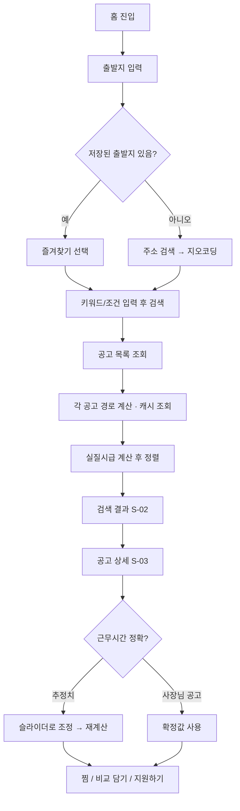

# 와이어프레임 — 리알바 (RealBa)

모바일 우선(360–430px) 설계. 데스크톱은 2컬럼으로 확장합니다.
브라우저에서 볼 수 있는 시각 버전: [wireframe.html](wireframe.html)

---

## 1. 정보 구조 (IA)

```
리알바
├─ 홈 / 검색                      S-01
│  └─ 검색 결과                   S-02
│     ├─ 공고 상세               S-03
│     └─ 공고 비교               S-09
├─ 단독 계산기                    S-04
├─ 로그인 / 회원가입              S-05
├─ 마이페이지                     S-08
│  ├─ 찜한 공고
│  ├─ 계산 이력
│  └─ 내 출발지 관리
└─ 사장님
   ├─ 대시보드                    S-06
   └─ 공고 등록 / 수정            S-07
```

---

## 2. 핵심 사용자 플로우



---

## 3. 화면별 와이어프레임

### S-01 홈 / 검색

```
┌──────────────────────────────────┐
│ ☰  리알바            [로그인] │
├──────────────────────────────────┤
│                                  │
│   시급 12,000원 알바,            │
│   진짜로는 9,276원입니다.        │
│   교통비와 출퇴근 시간까지       │
│   계산해 드릴게요.               │
│                                  │
│ ┌──────────────────────────────┐ │
│ │ 📍 출발지                    │ │
│ │ [ 우리집 주소를 입력하세요 ] │ │
│ │  ⌄ 최근: 신촌역 / 집 / 학교  │ │
│ └──────────────────────────────┘ │
│ ┌──────────────────────────────┐ │
│ │ 🔍 어떤 알바를 찾으세요?     │ │
│ │ [ 카페, 편의점, 물류 ...   ] │ │
│ └──────────────────────────────┘ │
│ ┌──────────────────────────────┐ │
│ │ ⏱ 하루 근무시간   [ 5 ]시간  │ │
│ │    ●────────────────────     │ │
│ └──────────────────────────────┘ │
│                                  │
│  [ 실질시급으로 찾기  →  ]       │
│                                  │
│  ─────── 또는 ───────            │
│  [ 공고 없이 직접 계산하기 ]     │
│                                  │
├──────────────────────────────────┤
│  🏠홈   🔍검색   ♡찜   👤마이   │
└──────────────────────────────────┘
```

**요소**

| ID | 컴포넌트 | 동작 |
|---|---|---|
| `origin-input` | `PlaceAutocomplete` | 입력 300ms 디바운스 → `/api/geocode` 자동완성. 선택 시 `{lat,lng,label}` 확정 |
| `origin-recent` | `Chip[]` | 로그인 시 `saved_places`, 비로그인 시 localStorage 최근 3건 |
| `keyword-input` | `Input` | 빈 값 허용(전체 검색) |
| `hours-slider` | `Slider` 1~12, 0.5 단위 | 기본값 5. 이후 화면 전역 기본 근무시간으로 사용 |
| `cta-search` | `Button` | 출발지 미확정 시 비활성 + 헬퍼 텍스트 |

**상태** — 지오코딩 실패 시 인풋 하단 헬퍼: `주소를 찾지 못했어요. 지하철역이나 동 이름으로 다시 시도해 보세요.`

---

### S-02 검색 결과

```
┌──────────────────────────────────┐
│ ←  신촌역 출발 · 카페     [필터]│
├──────────────────────────────────┤
│ 정렬 [실질시급순▾] 하루[5h▾]     │
│ 🏷 사장님공고만  최저임금이상    │
├──────────────────────────────────┤
│ 총 48건 · 실질시급 기준 정렬     │
│                                  │
│ ┌──────────────────────────────┐ │
│ │ [사장님공고]      ♡  [비교+] │ │
│ │ 연희동 로스터리 바리스타     │ │
│ │ 서울 서대문구 연희동         │ │
│ │                              │ │
│ │  시급 10,500원               │ │
│ │  ↓                           │ │
│ │  실질 9,544원  🟢 -9.1%      │ │
│ │                              │ │
│ │ 🚇 10분 · 💸 1,600원(왕복)   │ │
│ │ ⏱ 09:00–14:00 (5h) 확정      │ │
│ └──────────────────────────────┘ │
│                                  │
│ ┌──────────────────────────────┐ │
│ │ [사람인]          ♡  [비교+] │ │
│ │ ○○물류 상하차 아르바이트     │ │
│ │ 경기 고양시 덕양구           │ │
│ │                              │ │
│ │  시급 12,000원               │ │
│ │  ↓                           │ │
│ │  실질 9,276원  🔴 -22.7%     │ │
│ │                              │ │
│ │ 🚇 35분 · 💸 2,800원(왕복)   │ │
│ │ ⏱ 5h 추정 ⓘ                  │ │
│ └──────────────────────────────┘ │
│                                  │
│        [ 더 보기 ]               │
├──────────────────────────────────┤
│  🏠   🔍   ♡   👤    [비교 2]▲  │
└──────────────────────────────────┘
```

**정렬 옵션** — 실질시급순(기본) / 명목시급순 / 이동시간 짧은순 / 최신순 / 손실률 낮은순

**배지 규칙**

| 손실률 | 색 | 라벨 |
|---|---|---|
| 0~10% | 🟢 green | 양호 |
| 10~20% | 🟡 amber | 보통 |
| 20% 이상 | 🔴 red | 손해 큼 |
| 실질시급 < 최저임금 | ⚫ gray + 경고 | 최저임금 미만 |

**상태**
- 로딩: 스켈레톤 카드 5개. 경로 계산이 오래 걸리므로 카드별 부분 로딩 — 시급은 즉시, 실질시급은 `계산 중…`
- 빈 결과: `조건에 맞는 공고가 없어요. 키워드를 줄이거나 거리 필터를 넓혀 보세요.` + [필터 초기화]
- 경로 계산 실패: 카드에 `경로를 찾지 못했어요` 표시 + 명목시급만 노출, 정렬에서 후순위

---

### S-03 공고 상세

```
┌──────────────────────────────────┐
│ ←   공고 상세            ♡  ⇪   │
├──────────────────────────────────┤
│ [사람인]  D-7                    │
│ ○○물류 상하차 아르바이트         │
│ ○○물류센터 · 경기 고양시         │
├──────────────────────────────────┤
│ ╔══════════════════════════════╗ │
│ ║  실질시급                    ║ │
│ ║      9,276원                 ║ │
│ ║  표시 시급 12,000원 대비     ║ │
│ ║  🔴 −2,724원 (−22.7%)        ║ │
│ ╚══════════════════════════════╝ │
│                                  │
│ ▸ 계산 과정                      │
│ ┌──────────────────────────────┐ │
│ │ 하루 버는 돈                 │ │
│ │  12,000 × 5h   =  60,000원   │ │
│ │  − 왕복 교통비 =  −2,800원   │ │
│ │  ────────────────────────    │ │
│ │  실수령        =  57,200원   │ │
│ │                              │ │
│ │ 하루 쓰는 시간               │ │
│ │  근무          =  5.00h      │ │
│ │  + 왕복 이동   =  1.17h      │ │
│ │  ────────────────────────    │ │
│ │  합계          =  6.17h      │ │
│ │                              │ │
│ │  57,200 ÷ 6.17 = 9,276원/h   │ │
│ └──────────────────────────────┘ │
│                                  │
│ ▸ 조건 바꿔보기                  │
│  하루 근무시간  [5.0h] ●──────   │
│  교통비 지원    [ 없음 ▾ ]       │
│  주휴수당 포함  [ OFF ]          │
│  ↻ 값이 바뀌면 자동 재계산       │
│                                  │
│ ▸ 이동 경로                      │
│ ┌──────────────────────────────┐ │
│ │   [ 지 도 영 역 ]            │ │
│ │  신촌역 ──🚇2호선── 합정     │ │
│ │  ──🚌7727── 원흥 · 도보 8분  │ │
│ │  편도 35분 · 1,400원 · 환승1 │ │
│ └──────────────────────────────┘ │
│                                  │
│ ▸ 공고 정보                      │
│  근무요일  월~금                 │
│  근무시간  5h (추정) ⓘ           │
│  고용형태  아르바이트            │
│  마감일    2026-09-19            │
│                                  │
│ [ 사람인에서 지원하기 ↗ ]        │
│ [ 비교함에 담기 ]                │
└──────────────────────────────────┘
```

> ⓘ 툴팁: `사람인 공고는 근무시간 정보를 제공하지 않아, 공고 문구에서 추정한 값입니다. 직접 조정해 보세요.`

사장님 공고일 때는 `▸ 공고 정보` 아래에 **사업장 소개 / 문의하기 버튼**이 추가되고, 근무시간은 `확정` 배지로 표시됩니다.

---

### S-04 단독 계산기

공고 없이 조건만 넣어 계산합니다. S-03의 `계산 과정` 카드를 그대로 재사용합니다.

```
┌──────────────────────────────────┐
│ ←  실질시급 계산기               │
├──────────────────────────────────┤
│  시급           [ 12,000 ] 원    │
│  하루 근무시간  [ 5.0    ] 시간  │
│                                  │
│  이동 정보 입력 방식             │
│  (•) 주소로 자동 계산            │
│  ( ) 직접 입력                   │
│                                  │
│  출발지 [ 신촌역          ] 📍   │
│  근무지 [ 고양시 덕양구…  ] 📍   │
│     ↳ 편도 35분 / 1,400원 (자동) │
│                                  │
│  교통비 지원 [ 일 1,000원 ▾ ]    │
│  주휴수당 포함 [ ON ]            │
│    주 근무시간 [ 25 ] 시간       │
│                                  │
│  ╔════════════════════════════╗  │
│  ║  실질시급  10,086원        ║  │
│  ║  (주휴수당 포함)           ║  │
│  ╚════════════════════════════╝  │
│  [ 계산 결과 저장 ]  [ 공유 ]    │
└──────────────────────────────────┘
```

---

### S-05 로그인 / 회원가입

```
┌──────────────────────────────────┐
│            리알바              │
│                                  │
│  [ 🟡 카카오로 3초 만에 시작 ]   │
│  [ 이메일로 계속하기 ]           │
│                                  │
│  ─────────────────────────       │
│  사장님이신가요?                 │
│  [ 사업자 회원가입 → ]           │
│                                  │
│  로그인하면 찜·계산 이력·        │
│  즐겨찾는 출발지를 저장합니다.   │
└──────────────────────────────────┘
```

회원가입 2단계: ① 계정 생성 → ② 역할 선택(`구직자` / `사장님`). 사장님 선택 시 사업자등록번호·상호 입력 폼으로 분기합니다.

---

### S-06 사장님 대시보드

```
┌──────────────────────────────────┐
│ 리알바 사장님        [로그아웃]│
├──────────────────────────────────┤
│  안녕하세요, 연희동 로스터리 님  │
│                                  │
│  ┌────────┬────────┬──────────┐  │
│  │ 진행중 │ 총 조회│ 찜한 사람│  │
│  │   2    │  1,284 │    37    │  │
│  └────────┴────────┴──────────┘  │
│                                  │
│  [ + 새 공고 등록 ]              │
│                                  │
│  내 공고                         │
│ ┌──────────────────────────────┐ │
│ │ 바리스타 파트타임   [진행중] │ │
│ │ 시급 10,500 · 09–14시        │ │
│ │ 조회 842 · 찜 24             │ │
│ │ 💡 반경 3km 구직자 기준      │ │
│ │    평균 실질시급 9,544원     │ │
│ │    (동네 카페 중 3위)        │ │
│ │ [수정] [마감] [통계]         │ │
│ └──────────────────────────────┘ │
│ ┌──────────────────────────────┐ │
│ │ 주말 마감 담당      [마감됨] │ │
│ └──────────────────────────────┘ │
└──────────────────────────────────┘
```

---

### S-07 공고 등록 / 수정

구조화 입력이 핵심입니다. 여기서 받은 값이 사람인 공고보다 **정확한 실질시급**을 만듭니다.

```
┌──────────────────────────────────┐
│ ←  공고 등록          [임시저장] │
├──────────────────────────────────┤
│ ①기본  ②근무조건  ③급여  ④확인  │
│ ●──────○──────○──────○           │
├──────────────────────────────────┤
│ 공고 제목 *                      │
│ [ 연희동 로스터리 바리스타     ] │
│                                  │
│ 근무지 주소 *                    │
│ [ 서울 서대문구 연희로 ...  ] 🔍 │
│ 상세주소 [ 1층                 ] │
│  ↳ 좌표 확인됨 (37.5xx, 126.9xx) │
│                                  │
│ 모집 직종 * [ 카페·음료 ▾ ]      │
│ 모집 인원   [ 2 ]명              │
├──────────────────────────────────┤
│ ② 근무조건                       │
│ 근무 요일 *                      │
│  [월][화][수][목][금][토][일]    │
│                                  │
│ 근무 시간 *                      │
│  [ 09:00 ] ~ [ 14:00 ]           │
│  휴게시간 [ 0 ]분                │
│  → 일 5.0시간 / 주 25.0시간      │
│  ☑ 요일마다 시간이 달라요        │
│                                  │
│ 고용형태 [ 아르바이트 ▾ ]        │
├──────────────────────────────────┤
│ ③ 급여                           │
│ 급여형태 (•)시급 ( )일급 ( )월급 │
│ 금액 [ 10,500 ]원                │
│  ⚠ 최저임금 이상이어야 합니다    │
│                                  │
│ 교통비 지원                      │
│  ( ) 없음                        │
│  (•) 일 정액  [ 1,000 ]원        │
│  ( ) 월 정액  [      ]원         │
│  ( ) 실비 전액                   │
│                                  │
│ 식대 제공 [ ON ]  주휴 지급 [ON] │
├──────────────────────────────────┤
│ ④ 확인 — 구직자에게 보이는 모습  │
│ ╔══════════════════════════════╗ │
│ ║ 반경 3km 구직자 기준         ║ │
│ ║ 예상 실질시급 9,544원        ║ │
│ ║ 동네 카페 평균 9,210원보다   ║ │
│ ║ 334원 높아요 👍              ║ │
│ ╚══════════════════════════════╝ │
│ [ 공고 등록하기 ]                │
└──────────────────────────────────┘
```

**검증 규칙**
- 시급 < 해당 연도 최저임금 → 등록 차단 + 안내
- 근무 종료시간 ≤ 시작시간 → 야간근무(자정 넘김) 여부 확인 모달
- 주소 지오코딩 실패 → 등록 불가. 좌표가 없으면 실질시급을 계산할 수 없습니다.

---

### S-08 마이페이지

```
┌──────────────────────────────────┐
│ 마이페이지                       │
├──────────────────────────────────┤
│ 👤 김구직 · 구직자               │
│                                  │
│ [찜한 공고] [계산 이력] [출발지] │
│  ───────                         │
│                                  │
│ ♡ 찜한 공고 (5)                  │
│ ┌──────────────────────────────┐ │
│ │ 연희동 로스터리  실질 9,544원│ │
│ │ ⚠ 마감 D-2                   │ │
│ └──────────────────────────────┘ │
│                                  │
│ 📍 내 출발지                     │
│  집   서울 마포구 …    [기본]    │
│  학교 서울 서대문구 …            │
│  [ + 출발지 추가 ]               │
└──────────────────────────────────┘
```

---

### S-09 공고 비교

```
┌──────────────────────────────────┐
│ ←  공고 비교 (3)        [초기화] │
├──────────────────────────────────┤
│            │  A   │  B   │  C   │
│ 표시 시급  │12,000│10,500│11,000│
│ 하루 근무  │  5h  │  5h  │  4h  │
│ 편도 이동  │ 35분 │ 10분 │ 22분 │
│ 왕복 교통비│2,800 │1,600 │2,200 │
│ ─────────────────────────────────│
│ 실질시급   │9,276 │9,544★│8,831 │
│ 손실률     │-22.7%│ -9.1%│-19.7%│
│ 하루 실수령│57,200│50,900│41,800│
│ 하루 구속  │6.17h │5.33h │4.73h │
├──────────────────────────────────┤
│ 💡 B가 시급은 낮지만 실질시급은  │
│    가장 높아요.                  │
└──────────────────────────────────┘
```

가로 스크롤 테이블. 각 행의 최고값 셀에 ★ 강조.

---

## 4. 공통 컴포넌트

| 컴포넌트 | 용도 | 주요 props |
|---|---|---|
| `PlaceAutocomplete` | 출발지/근무지 입력 | `value, onSelect(place)` |
| `JobCard` | 검색 결과 카드 | `job, calc, onFavorite, onCompare` |
| `RealWageBadge` | 실질시급 + 손실률 배지 | `nominal, real, minimumWage` |
| `CalcBreakdown` | 계산 과정 분해 | `result: RealWageResult` |
| `WorkHoursSlider` | 근무시간 조정 | `value, onChange, estimated?` |
| `RouteSummary` | 경로 요약 + 지도 | `route: TransitRoute` |
| `SourceBadge` | `사람인` / `사장님공고` | `source` |
| `EstimatedTag` | `추정치 ⓘ` 툴팁 | `reason` |
| `EmptyState` | 빈 결과 / 에러 | `title, description, action` |

---

## 5. 디자인 토큰 (초안)

```
color/primary      #1B64DA   행동 유도, 링크
color/good         #0F9D58   손실률 0~10%
color/warn         #F4B400   10~20%
color/bad          #DB4437   20% 이상
color/neutral-900  #1A1A1A   본문
color/neutral-500  #757575   보조 텍스트
color/neutral-100  #F5F5F5   카드 배경

font/display  28px / 700   실질시급 숫자
font/title    18px / 600   공고 제목
font/body     15px / 400
font/caption  13px / 400   보조 정보

radius/card   12px
space/unit    4px 기준 (4·8·12·16·24·32)
```

### 접근성
- 손실률은 색으로만 구분하지 않고 **부호와 퍼센트 텍스트를 항상 병기**합니다.
- 실질시급 숫자에 `aria-label="실질시급 9276원, 표시 시급 대비 22.7퍼센트 낮음"`을 제공합니다.
- 슬라이더는 키보드 방향키로 0.5시간 단위 조작이 가능해야 합니다.
